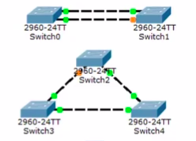

## Способы передачи сигналов
1. Электрические
2. Оптические
3. Радиосигналы

- медный кабель (электричество)
- оптоволокно (сетевой импульс)
- беспроводные сети

## Типы медных кабелей
- Неэкраннированная витая пара (UTP)(RJ-45)
- Экраннированная витая пара (STP)
- Коаксиальный кабель
    - BNC
    - N тип
    - F тип

## UTP
- UTP 3 категория 100 мгбит максимально
- UTP 5 категория 1 ггбит максимально
- UTP 6 категория 10 ггбит максимально

## Методы организации отказоустойчивых каналов связи
- Резервирование соединений. Традиционная избыточная топология. (Есть два линка, один работает, а второй в режима ожидании).
- Агрегрирование каналов. (Объединение нескольких физических каналов в один логический).

## Коммутационная петля
Это несколько соединений между коммутаторами, которые образуют некую подобие петли

### **Problems**:
- Широковешательные штормы
- Множественные копии кадров
- Множественные петли

Все они приводят к не работоспособности сети.

## SPT - Spanning Tree Protocol
- Защита от петель в сети
- Время сходимости (замены канала связи) 30-50 секунд
- Альтернативы: RSTP, MSTP (менее секунды)

LLC - помогает избежать конфликта, определяя технологию передачу данных (Ethernet, WLan, WPan)

LLC -> IP Address способ передачи
MAC -> физический адресс

# Топологии

1. Point to Point (Switch <-> Switch)
2. Star (PC, PC, PC -> Switch <-> Switch <- PC,PC,PC)
3. Ячеистая (каждый связан с каждым)

Дуплекс - передавать и принимать одновременно
Полудуплекс - либо передача, либо прием

# L3 коммутатор
Чисто маршрутизация.

